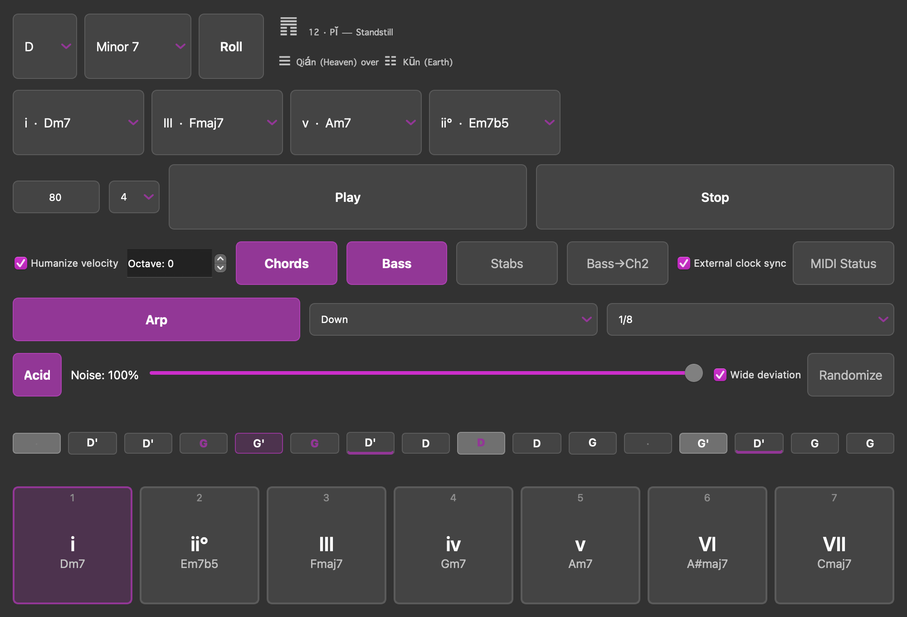
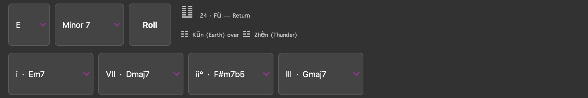
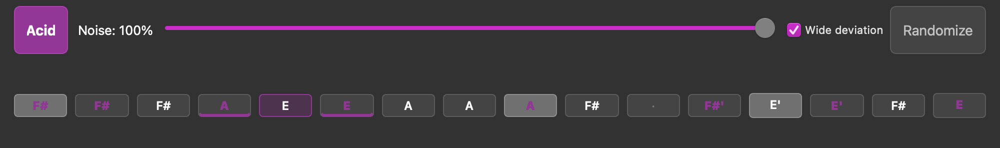

# m00Dr

A MIDI chord-progression and acid-line generator. You pick a key and a scale; m00Dr
builds the diatonic chords, plays a four-slot progression over MIDI, and layers a bass,
an arpeggiator and a TB-303-style acid sequencer on top of it — each on its own MIDI
channel, so a hardware groovebox or a DAW can voice them separately.

It drives external gear rather than making sound itself. There is no synthesis here: m00Dr
is a clock, a sequencer and a set of generators sending notes out of a port called `m00Dr`.



## What it does

**Chords, from theory rather than from a preset list.** Choose a key and one of eight
scales (Major, Minor, Byzantine and a generated "snhtri", each with a plain and a seventh
variant) and every diatonic chord is built for you. The seven pads along the bottom show
what each scale degree actually sounds like — `iv · Gm7`, not a bare roman numeral — and
play it when pressed or when you hit its number key.

**Four voices, four MIDI channels.** Chords, bass, arp and acid run from one transport and
can be muted independently while it plays.

| voice | MIDI channel | notes |
|---|---|---|
| Chords | 1 | sustained, or house-style off-beat stabs |
| Bass | 2 | the root of whichever chord is sounding |
| Arp | 3 | up / down / up-down / random, at 1/4, 1/8 or 1/16 |
| Acid | 5 | a 16-step 303-style line — see below |

**Clock.** m00Dr generates MIDI Beat Clock as master, or follows an external clock as a
slave (the default — most sessions run against a DAW or hardware that owns the tempo).
Tempo, loop length (1–4 slots) and an octave shift are live controls.

## The Roll button



Roll rewrites the key, the scale and the progression as a **move around the circle of
fifths**, with the step sizes drawn by I Ching coin tosses.

Three coins are thrown per line, six lines per cast. The weighting that falls out —
3/8, 3/8 for the static lines and 1/8, 1/8 for the changing ones — is the reason to draw
this way rather than with a flat random choice: a roll usually nudges by one fifth and
only occasionally leaps by two. The six lines are spent bottom-up, the order a hexagram is
read in, and split the way the app does: the lower trigram is the ground (key, scale, and
the tonic the progression stands on), the upper trigram is the movement (the other three
slots).

Because every result is relative to what is already selected, repeated rolls wander
through related territory instead of teleporting somewhere unconnected each time. Slot 1
is always the tonic, so the movement in the other slots has a home to be heard against,
and the four slots always land on four distinct degrees. The cast is named on screen by
its hexagram and trigrams, and the changing-line transformation is in the tooltip.

## The acid sequencer



A locked-in 16-step pattern, one step per 16th note, so a full pattern is exactly one bar.
The lane shows it as it will actually sound: the note each step plays or `·` for a rest, a
trailing apostrophe for an octave jump, a bright cell for an accent, a tie line under a
step that slides into the next. The lit cell is the playhead.

The pattern is written in scale degrees *relative to the bar's chord root*, so the same 16
steps respell themselves as the progression moves.

It is generated from what transcriptions of the famous 303 lines actually do, which is not
what you might expect. Real acid lines are **root-heavy** — Josh Wink's *Higher State of
Consciousness* is two pitches, and DJ Tim & Misjah's *Access* is a single pitch across all
16 steps. They are not built from pitch variety; they are built from **octave jumps,
accents and slides** over a tiny recurring palette. So each step is dealt four I Ching
lines — what it plays, which octave, whether it is accented, whether it slides — and the
non-root palette is cast once per pattern, which is what makes it a riff rather than a
wander. A cast at full depth comes out around 13% rests, 38% root, 22% each octave-jumped,
accented and slid.

A slide is real, not cosmetic: the sliding step's note-off is sent *after* the next
note-on, and that overlap is what lets the receiving synth's portamento glide instead of
retriggering.

**Noise** is how much of the cast is let through: 100% is the reading as drawn, 0% folds
everything back to a straight 16th-note pulse on the root. **Wide deviation** sets how far
around the circle of fifths the palette is drawn from — one fifth either way gives the
fourth and the fifth, two fifths adds the flat seventh and the second.

## Running it

Requires Python 3.12+ and [uv](https://docs.astral.sh/uv/).

```sh
uv sync
uv run python main.py
```

m00Dr creates a virtual MIDI output called `m00Dr`, and `m00Dr In` when external clock
sync is on. Point your DAW or hardware at them.

```sh
uv run pytest        # 197 tests
```

## Hardware

The **MIDI Status** dialog lists the ports m00Dr depends on, can reset the platform's MIDI
service when one goes stale (after sleep, or a device replug), and manages the bridge
scripts that connect m00Dr to a Dirtywave M8 or a Novation Circuit — including ones you
started in a terminal yourself, which it adopts, restarts, and stops when m00Dr closes.

`m8-project-gen/` generates an M8 `.m8s` project with the channel map above already wired
and four instruments voiced to match, including an acid patch built the way a 303 is: a
saw through a lowpass that starts closed, with high resonance and a fast envelope on the
*cutoff*, because the squelch is that filter sweep repeating per note.

```sh
cd m8-project-gen && npm install && npm run generate:303
```

See [`M8-SETUP.md`](M8-SETUP.md) for the full working configuration, and
[`ROADMAP.md`](ROADMAP.md) for design decisions and session history.

## Layout

```
moodr/
  app.py         PySide6 window: every control, and the widget state the engine reads
  playback.py    the sequencer — chords, bass, arp, stabs, acid — driven by clock ticks
  oracle.py      circle-of-fifths moves chosen by I Ching coin tosses
  theory.py      scales, chord building, note/MIDI conversion
  clock.py       MIDI Beat Clock, as master or slave
  midi_io.py     virtual MIDI ports and message generation
  bridge_manager.py   discovers, starts, adopts and stops the hardware bridge scripts
  theme.py       the stylesheet, derived from the running Qt palette
```
